

  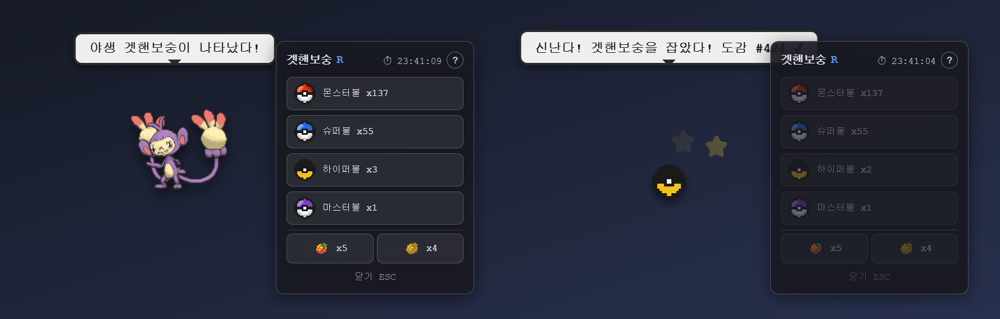

<h1 align="center">toketmon</h1>

<b>Code, and Pokémon appear.</b> 
A Windows desktop tray app that turns your Claude Code / Codex token usage into a Pokémon collecting game.

  <b>Current version: v0.6.1</b> · <b>Non-commercial, personal fan project</b> 
  Not affiliated with, endorsed by, or sponsored by Nintendo, Creatures Inc., GAME FREAK inc., or The Pokémon Company.

English | <a href="README.ko.md">한국어</a>

---

> **Language note:** The app UI is currently **Korean only**, and the screenshots below show the Korean UI.
> In-app support for other languages is planned for a later release. This README is the English entry point in the meantime.

## What it is

Install it, leave it running, and keep coding. toketmon watches your Claude Code and Codex session logs in the background
and turns the tokens you use into rewards: **wild Pokémon appear on your screen**, and items like balls, candy, and
evolution stones drop along the way. Catch them, raise them, evolve them, let them walk around your desktop, and battle or
trade with a friend on the same network.

- Lives in the system tray and never interrupts your workflow.
- Pokémon data and sprites are fetched from [PokeAPI](https://pokeapi.co/) on first launch and cached locally. Works offline afterwards.
- Supports 649 species from Generations 1–5.

## Features

### 🌿 Wild encounters & catching

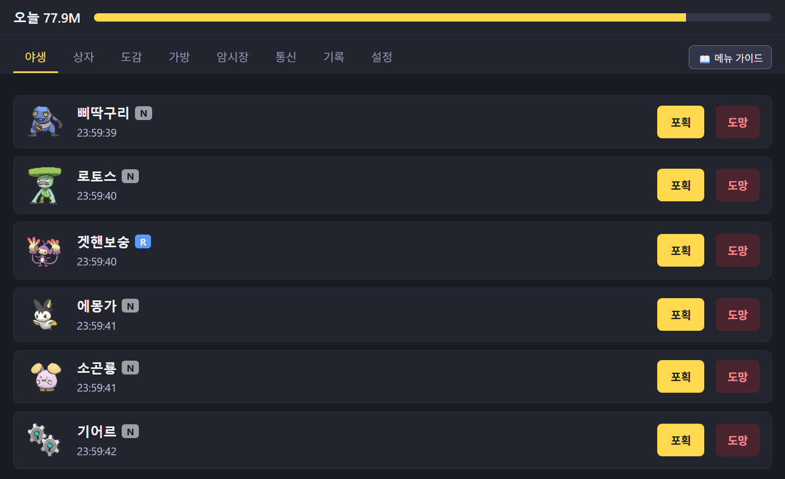

- As you use tokens, wild Pokémon show up in the Wild tab. Rarity ranges from **N / R / SR / SSR / UR**, and shiny ✨ Pokémon appear very rarely.
- Each encounter expires after a while, so catch it before it leaves.
- Hit **Catch** (포획) and a transparent overlay appears on your screen. Pick a ball and throw. Higher rarity and weaker balls mean lower odds, and a failed throw may let the Pokémon flee.
- Filling your Pokédex raises your critical-catch chance, and berries boost catch rates.
- Your first coding session each day grants free balls and a guaranteed encounter. Daily streaks raise the shiny rate.

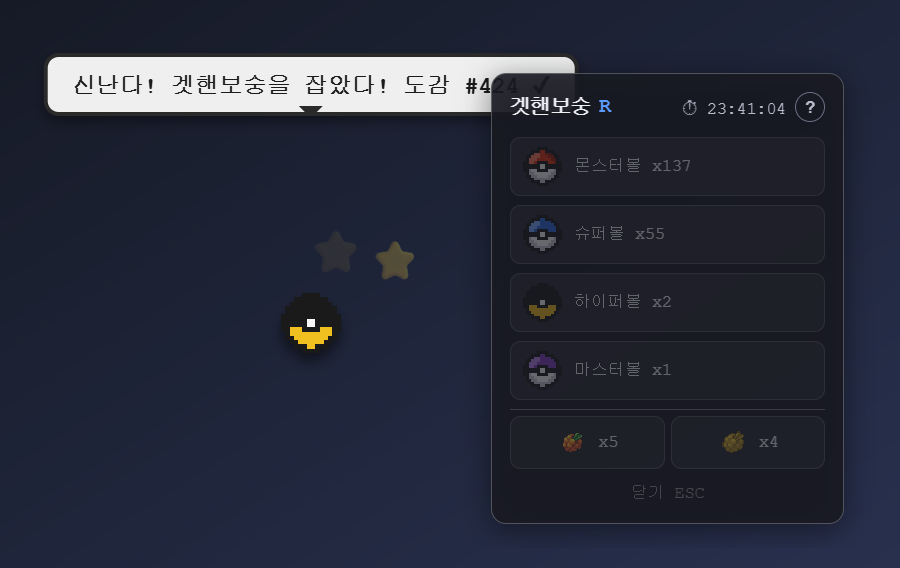

### 📦 Storage: raising & evolution

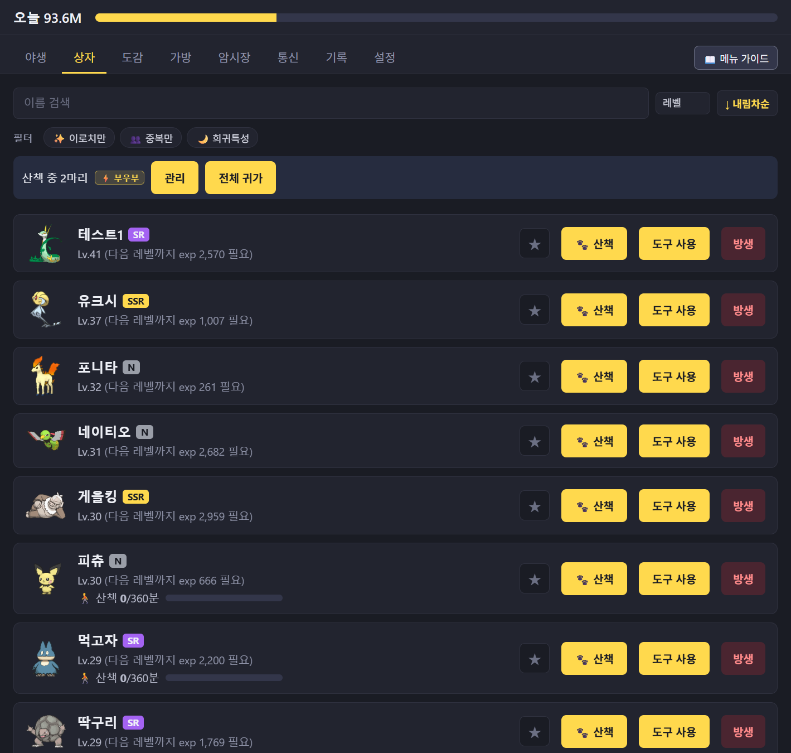

- Caught Pokémon go to Storage. Search, sort, filter (shiny, duplicates, hidden ability), favorites, and nicknames are supported.
- Feed **candy** to gain EXP. Each species follows its own growth curve from PokeAPI.
- **Evolution** supports level, evolution stone, held item, trade, and walking-friendship conditions. Branching evolutions let you choose.
- Every Pokémon has an ability (including hidden abilities), a nature, and base stats that carry into battle.

### 🐾 Walk: Pokémon on your desktop

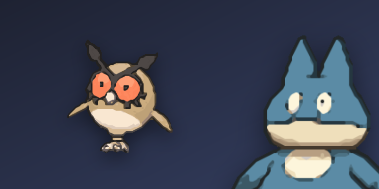

- Press **Walk** (산책) in Storage and that Pokémon wanders around your monitor. You can release several at once.
- Walking Pokémon earn EXP over time and build friendship for friendship-based evolutions.
- Click a pet to select it, then resize it, send it in front of or behind other windows, or recall it to its ball with hotkeys.

### 📕 Pokédex

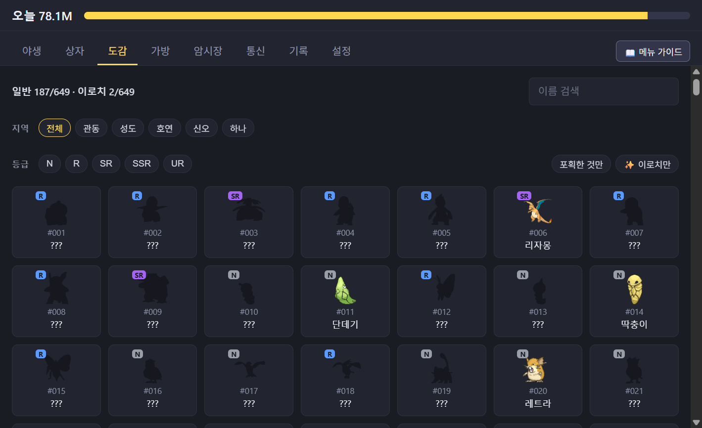

- Filter by region (Kanto to Unova), rarity, shiny, and caught status.
- Open a species to see its types, abilities, base stats, and moves.
- Registration milestones grant **Master Balls** (guaranteed catch).

### 🎒 Bag & 🐱 Black Market

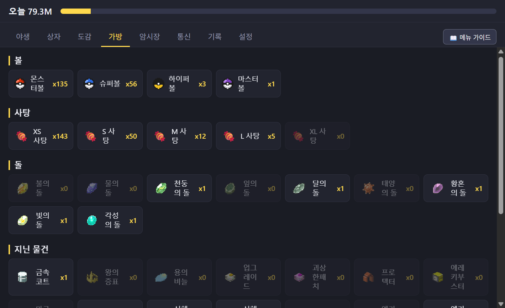

- Manage balls, candy, evolution stones, held items, and berries. Items drop by chance as you use tokens.

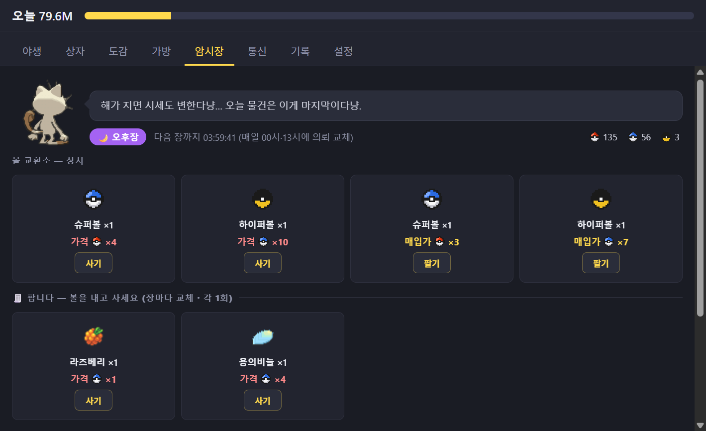

- The **Black Market** opens twice a day. Trade balls with Meowth for better balls, berries, and held items, or sell what you don't need.

### ⚔️ Battle: 5-vs-5 with a friend

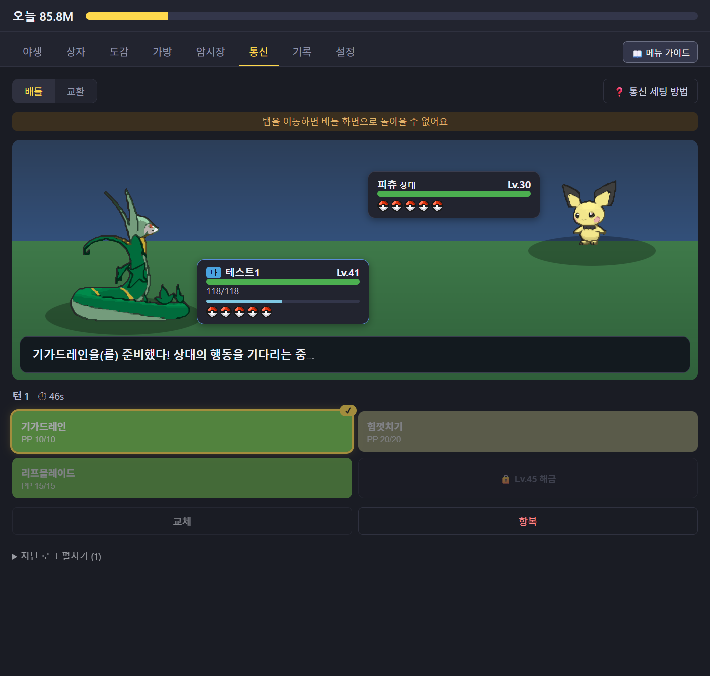

Two PCs on the same Wi-Fi/LAN (or VPN) **connect directly** for real-time battles. No relay server, no account.

1. One player presses **Host** (호스트 시작) in the Network tab and gets an invite code (IP:port).
2. The other enters it under **Join** (접속하기). Allow the Windows Firewall prompt on the host side if it appears.
3. Both players secretly **pick 5 Pokémon** from Storage, then team preview is revealed and the battle begins.

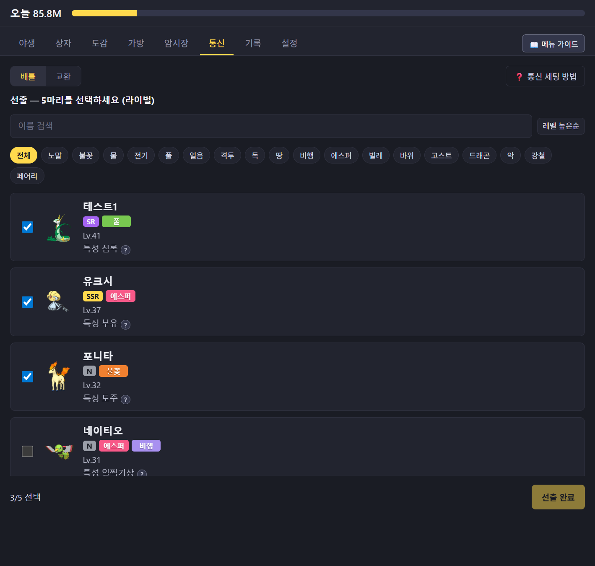

Battle rules stay close to the original games.

- Original damage formula, **18-type matchup chart**, physical/special split, STAB, accuracy, and critical hits
- Status conditions, stat stages, **weather** and weather abilities
- Each species has 4 fixed moves unlocked by level. Out of PP means Struggle.
- Free switching every turn, a **per-turn time limit** (auto-action on timeout), and forfeit. Disconnecting counts as a loss.
- Results are kept in **Battle Records**. Battles never cost or grant items.

### 🔄 Trade

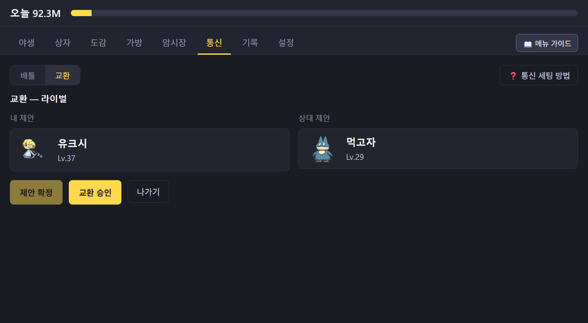

- Connect the same way as a battle, offer one Pokémon each, then **confirm → approve** to complete the trade.
- Pokémon that evolve by trading in the original games (e.g. Haunter → Gengar) evolve after a trade.

### 🤖 Auto-catch & records

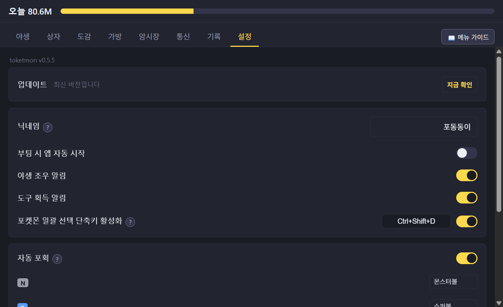

- Turn on **Auto-catch** and wild Pokémon that appear while the window is closed are caught for you. Choose which ball to use per rarity, whether to fall back to a weaker ball, and whether to catch species you already own.
- The Records tab lists missed Pokémon and every auto-catch result.

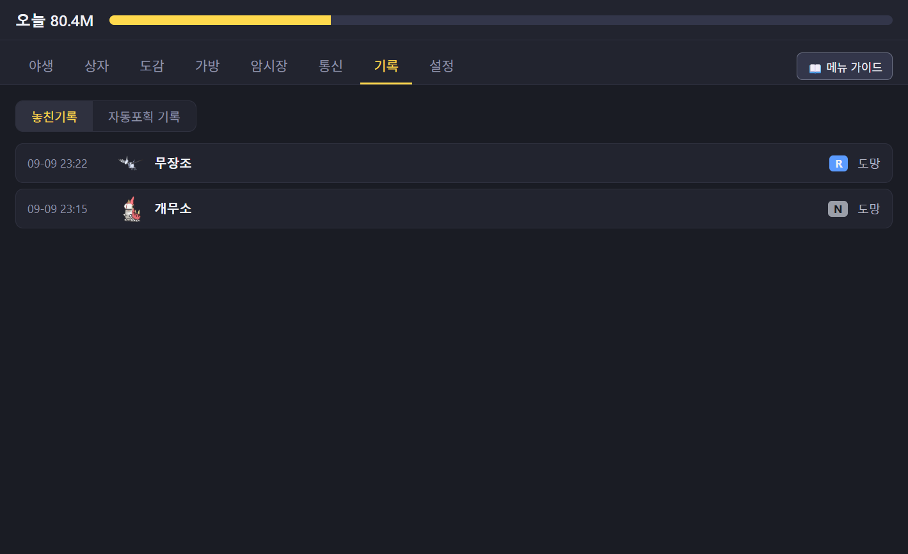

- Windows notifications for encounters and item drops, plus an optional start-on-boot setting.

### And more

- The **guide menu** at the top right of each tab shows every number in the app: catch-rate tables, the type chart, stat-stage multipliers, and so on.
- If a watched project folder is a git repository, your commits count toward rewards too.

---

## Download

Grab `toketmon-<version>-setup.exe` from the [latest release](https://github.com/cpu500m/toketmon/releases/latest).
Each release description is that version's patch notes.

This repository is **for distributing installers only** and does not contain source code.

## Install

1. If toketmon is already running, quit it first (right-click the tray icon → Quit).
2. Run `toketmon-<version>-setup.exe`. You can choose the install location; no administrator rights are required.
3. On first launch the app downloads Pokémon data and sprites from [PokeAPI](https://pokeapi.co/). Please wait until it finishes. Everything is cached locally afterwards.

### If Windows shows a "protected your PC" warning

The installer is not code-signed, so Windows SmartScreen may warn you. Click **More info**, then **Run anyway**.

## Auto-update

Since v0.5.5 the app checks for new versions on its own. When one is available, a banner appears at the top of the app.
Press **Download**, then **Restart and install** once the patch notes are shown. You can postpone and update later from Settings.

## Game data

Your Pokémon, Pokédex, and items are stored in `%APPDATA%\toketmon`. Updating or reinstalling never deletes this folder.
Delete it manually if you want a fresh start.

## Notice

- This is a **non-commercial, personal fan project** with **no revenue of any kind**: no sales, ads, or donations.
- **All rights to Pokémon and related characters, names, and images belong to Nintendo, Creatures Inc., and GAME FREAK inc. (The Pokémon Company).** This project is not affiliated with, endorsed by, or sponsored by them.
- Pokémon data and sprites are fetched from [PokeAPI](https://pokeapi.co/) at runtime and cached only on the user's PC. Neither this repository nor the installers contain any original assets. Screenshots in this document are for illustrating the app's UI.
- Distribution will stop immediately upon request from the rights holders.
- **Rights holder inquiries:** please open an [Issue](https://github.com/cpu500m/toketmon/issues) in this repository and it will be handled promptly.
